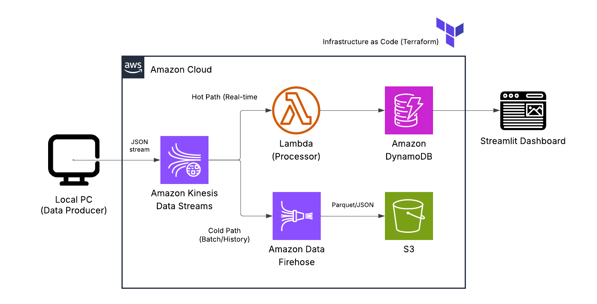
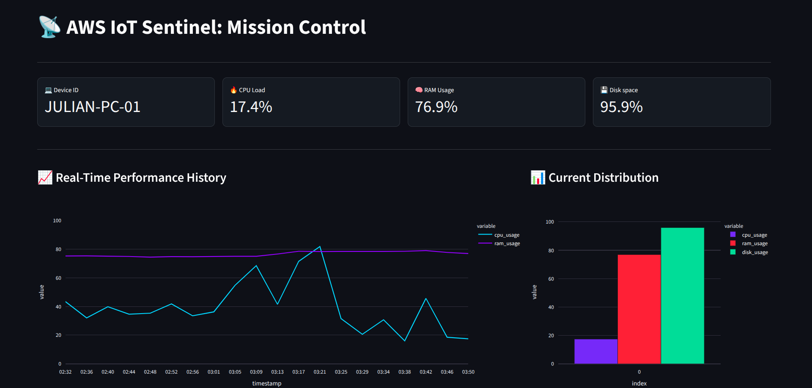
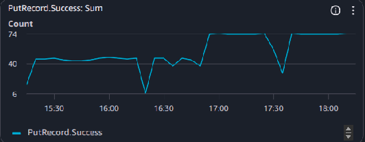
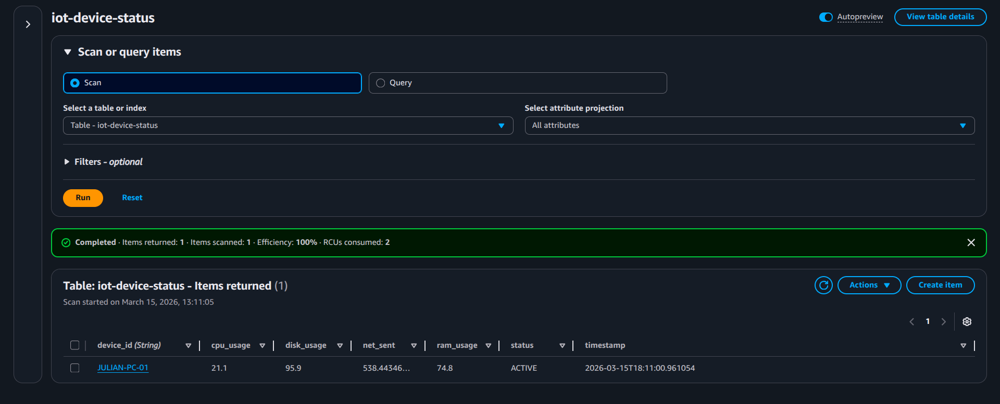
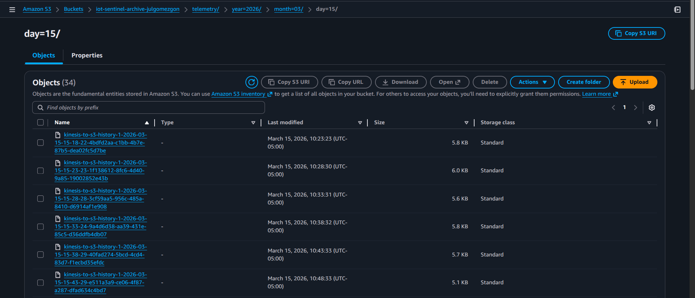

# AWS IoT Sentinel: Real-Time Hardware Telemetry Pipeline 📡☁️

[](https://www.credly.com/)
[](https://www.terraform.io/)
[](https://www.python.org/)

## 📌 Project Overview
This project implements a high-frequency **IoT Telemetry Pipeline** on AWS, designed to monitor industrial-grade assets (simulated by local hardware metrics). It demonstrates a complete **Lambda Architecture** (Hot and Cold paths) to handle real-time monitoring and long-term data archiving.

The entire infrastructure was deployed using **Infrastructure as Code (Terraform)**, ensuring a repeatable, secure, and cost-optimized cloud environment.

## 🏗 Architecture Diagram
 
*The pipeline ingestion flows from a Local Device to Kinesis, then branches into DynamoDB for real-time state and S3 for historical analysis.*

## 🚀 Key Engineering Features
*   **Infrastructure as Code (IaC):** Automated deployment of 6+ AWS resources using **Terraform**, eliminating manual configuration errors.
*   **Hot Path (Real-time):** Sub-second state updates in **Amazon DynamoDB** via **AWS Lambda**, enabling immediate operational visibility.
*   **Cold Path (Batch):** Automated data archiving to **Amazon S3** using **Kinesis Data Firehose**, implementing Hive-style partitioning for future Big Data processing.
*   **Real-time Visualization:** An interactive dashboard built with **Streamlit** and **Plotly** to visualize hardware stress tests and system health.

## 🛠 Tech Stack
*   **Languages:** Python (psutil, boto3, pandas, plotly), SQL.
*   **Ingestion:** Amazon Kinesis Data Streams.
*   **Processing:** AWS Lambda (Serverless).
*   **Storage:** Amazon DynamoDB (NoSQL) & Amazon S3 (Data Lake).
*   **Orchestration:** Amazon Kinesis Firehose.
*   **Automation:** Terraform.

## 🧠 Engineering Challenges & Troubleshooting

### 1. Cloud Infrastructure Activation
*   **Challenge:** Encountered `SubscriptionRequiredException` during Terraform deployment.
*   **Solution:** Managed AWS account verification and billing validation to unlock advanced streaming services (Kinesis), ensuring compliance with AWS service-level requirements.

### 2. Data Persistence (Float vs. Decimal)
*   **Challenge:** The Lambda function failed to write hardware metrics to DynamoDB due to a "Float types are not supported" error in the Boto3 SDK.
*   **Solution:** Refactored the processing logic to implement custom JSON parsing using the `decimal` library, ensuring all telemetry data was correctly typed for NoSQL storage.

### 3. UI Race Conditions
*   **Challenge:** High-frequency refreshes caused `DuplicateElementKey` errors in the Streamlit dashboard.
*   **Solution:** Optimized the frontend using `st.empty()` containers and `st.session_state` to maintain a local history buffer, resulting in a stable and fluid real-time monitoring experience.

## 📊 Proof of Implementation

### Real-Time Mission Control (Streamlit)

*Live tracking of CPU/RAM usage during a stress test.*

### System Observability (CloudWatch)

*Kinesis throughput showing successful `PutRecord` operations over time.*

### Data Storage Evidence
| Hot Storage (DynamoDB) | Cold Storage (Amazon S3) |
| :---: | :---: |
|  |  |
| *Latest device state.* | *Partitioned historical logs.* |

## 🚀 How to Run
1.  **Deploy Infrastructure:**
    ```bash
    cd terraform/
    terraform init
    terraform apply
    ```
2.  **Start Telemetry Stream:**
    ```bash
    python src/producer.py
    ```
3.  **Launch Dashboard:**
    ```bash
    streamlit run src/dashboard.py
    ```

---
**Developed by:** [Julian Gomez Gonzalez](https://www.linkedin.com/in/julian-gomez-gonza)  
*Electronics Engineering Student @ UNAL | AWS Certified Solutions Architect*